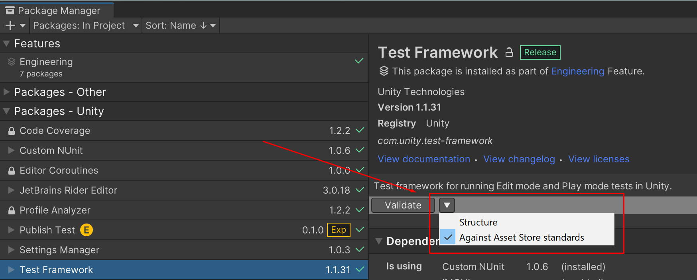

# About Asset Store Validation suite

Asset Store Validation Suite is a validation package designed to validate that UPM packages meet all necessary requirements to be uploaded 
to the Asset Store. This package is a bundle of tests that help the user in the process of checking that packages have the proper structure 
and meet the requirements of the Asset Store.

<a name="installing"></a>
# Installing the Asset Store Validation Suite

If you need to make changes to the code or configuration files of the Asset Store Validation Package you will need to clone it's repository 
from GitHub and add that local copy of the package to your test project.

Once you have the files locally you need to add the package from there to your project using the Add Package from Disk option in the Package 
Manager UI


Alternatively you can add an entry for it manually to the dependencies in your project's Packages/Manifest.json file to let Unity know where 
to find it, e.g :
```
"dependencies": {
        "com.unity.asset-store-validation": "file:C:/Source/com.unity.asset-store-validation/master"
    }
```

### Checking The Asset Store Validation Package Is Installed
Once the package is installed, you should find the Asset Store Validation Package, and Package Validation Suite in your project's Packages Folder:


# Using the Asset Store Validation Suite

The Asset Store Package Validation Suite can be used interactively from within the Editor via the Package Manager UI extension mechanism.

## Selecting a test suite

A test suite is a collection of tests that validate a package for a specific purpose, with tests being able to be part of multiple test suites.

To select a test suite, simply select a package you would like to validate and then use the dropdown to select which test suite will be used for 
the validation.

## Validating a package

After selecting a package, the Validate button will become available to execute the selected test suite. Clicking on this button will cause 
the validation to start and show its results after completion. Alternatively, a *View Results* button will appear letting you open the validation report file.




**NOTE:** If you can see the Asset Store Validation package is installed but the *Validate* button is not visible close the *Package Manager* 
window and re-open it.


## Validations

The following validation tests are currently implemented in the Asset Store Validation Suite:

* [Assemblies Definition Validation](assemblies_definition_validation.md)
* [Assemblies JSON Validation](assemblies_json_validation.md)
* [Asset Store Publisher Validation](asset_store_publisher_validation.md)
* [Author Field Validation](author_field_validation.md)
* [Changelog Validation](changelog_validation.md)
* [Documentation Validation](documentation_validation.md)
* [Name Field Validation](manifest_name_field_validation.md)
* [Meta Files Validation](meta_files_validation.md)
* [Minimum Package Manifest Validation](minimum_package_manifest_validation.md)
* [Mixamo Files Validation](mixamo_files_validation.md)
* [No Compressed Audio Files Validation](no_compressed_audio_files_validation.md)
* [No Executables Validation](no_executables_validation.md)
* [No JPGs Validation](no_jpgs_validation.md)
* [No Symlinks Validation](no_symlinks_validation.md)
* [Package Dependencies Validation](package_dependencies_validation.md)
* [Mandatory Package Unity Field Validation](mandatory_package_unity_fields_validation.md)
* [Version Field Validation](package_version_check.md)
* [Path Length Validation](path_length_validation.md)
* [Samples Structure Validation](samples_structure_validation.md)
* [Unique Package ID Validation](unique_package_id_validation.md)
